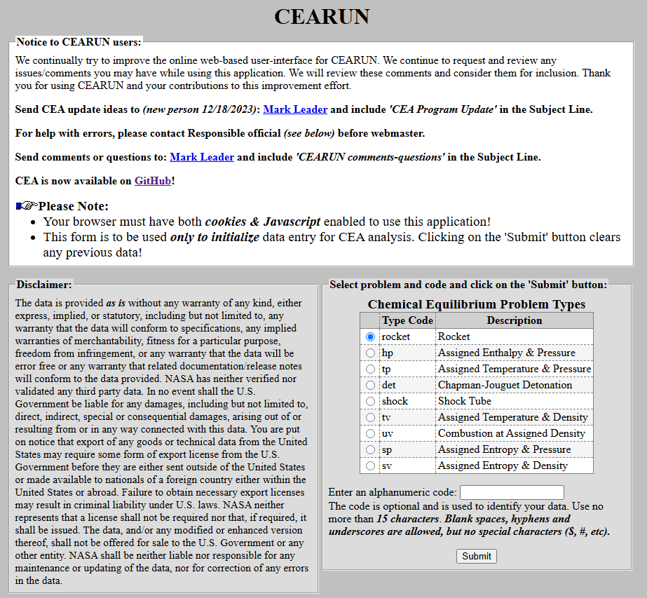

# NASA-CEA Web

In this guide, you will learn how to use the NASA CEARun web version to obtain equilibrium combustion properties, theoretical rocket performance, chamber temperature, characteristic velocity, specific impulse, and exhaust composition for a selected propellant combination. For anything rockets, this is a site you will be visiting frequently for a variety of reasons. In GTPL, you will need it for purposes including but not limited to:

* Obtaining Isp, c\*, expansion ratio, Cf, for engine design
* Obtaining combustion properties and product mole fractions to design things for regen & film cooling

This goes over how to obtain those values given a fixed set of conditions. It is the foundation of the foundation of the foundation to rocket design, so please make sure you are familiar with what the solver is doing on the high level such that you can incorporate it into your design effectively.&#x20;

The limitations of the web version is, of course, that you can't directly integrate it into your script. Hence, we will be using the python (our main script language) / Matlab with the downloadable version of MATLAB which we are able to obtain from NASA @ [https://github.com/nasa/cea](https://github.com/nasa/cea) and run locally for full design workflow, batch cases, and integration with our own design tools. For that, please check out [nasa-cea-python.md](nasa-cea-python.md "mention"). The download process is quite complicated so make sure to reach out to Baldwin or Michael if you have any troubles.&#x20;


* Official link to NASA-CEA: [https://cearun.grc.nasa.gov/](https://cearun.grc.nasa.gov/)
* CEARun has a lot to offer, but for our purposes we will focus on only the rocket CEA.&#x20;

<figure><figcaption></figcaption></figure>


### Select Chamber Pressure

Here, you have fields which you can choose to fill on either the left or right, not both!&#x20;

* Use left side when you have a range of chamber pressure you would like to iterate through. You give it a low value say 1, you give it a high value say 10, and if you define the interval to be 1 you end up with results going from Pc = 1, Pc = 2, Pc = 3, and so on to Pc = 10.
  * This option is what you would use if let's say you were experimenting with different chamber pressures. Then, you would use this option to help you narrow down the a range (if there's a specific metric you're looking to optimize/hit) before running the same thing again at a finer interval.
* Use right side (pick 1 box/however many pressure you know you would like to obtain these properties) when you are sure of what chamber pressures you'd like to analyze.&#x20;

Here, let's say I want to see how my engine does at 40 barA. <mark style="color:red;">**DON'T FORGET YOUR UNITS!**</mark>

<div><figure><figcaption></figcaption></figure> <figure><figcaption></figcaption></figure></div>

### Select Fuel & Oxidizer

More often than not, your desired fuel and oxidizer will not be the on the front page of your fuel/oxidizer selection page. So, head to **"Use Periodic Table (mixtures)"**

<figure><figcaption></figcaption></figure>

Here, you want to select the elements that make up your fuel. At this time of writing, we're still working on the 1000N N2O(L)/Paraffin engine and since we're on the fuel page, we select the elements that make-up paraffin (paraffin = saturated hydrocarbons made of carbon and hydrogen chains so we pick **"Carbon"** and **"Hydrogen"** on the periodic table.

<figure><figcaption></figcaption></figure>

CEA's got a pretty big database, so you can go ahead and select what you want most of the time once you've entered its elements! Here, we select **"Paraffin"** because that's the fuel we're working with. After that, you'll be asked to fill in the paraffin wt% (how much of your fuel grain is made of paraffin by weight). Here, you can add other fuels if they are mixed with paraffin which in that case you should also have selected those at the previous tab.&#x20;

Then, you'll be asked to fill in properties such as temp, enthalpy, or density. If you know those values, you can fill them in. If not, you can also skip in which case CEARun will take the default database value which corresponds to the most typical conditions which they are used in (most of the time) so it also works. Repeat the exact same procedures for your oxidizer (which in this example is N2O(L).

<figure><figcaption></figcaption></figure>

<div><figure><figcaption></figcaption></figure> <figure><figcaption></figcaption></figure></div>

<figure><figcaption></figcaption></figure>

### Select O/F Ratio

Here, you have fields which you can choose to fill on either the left or right, not both (exactly like chamber pressure)!&#x20;

* Use left side when you have a range of O/F you would like to iterate through. You give it a low value say 1, you give it a high value say 10, and if you define the interval to be 1 you end up with results going from O/F = 1, O/F = 2, O/F = 3, and so on to O/F = 10.
  * This option is what you would use if let's say you were experimenting with a new propellant and you are unsure what the optimal Isp/c\* is. Then, you would use this option to help you narrow down the optimal range before running the same thing again at a finer interval.
* Use right side (pick 1 box/however many pressure you know you would like to obtain these properties) when you are sure of what&#x20;

Here, I'll use 7.1 as that's the operating O/F ratio of our 1000N engine.&#x20;

<figure><figcaption></figcaption></figure>

### Define Exit Conditions

There are three options for which you are able to use. For the most part, you will use the first.

* **Pc/Pe (Chamber/Exit Pressure Ratio):** Use this for most rocket performance calculations. This is the easiest option when you know chamber pressure and want to define the nozzle exit condition using pressure ratio. Using this option will give you the required expansion ratio which you need to calculate the nozzle exit diameter!
* **Subsonic Area Ratio:** Use this only when you are analyzing a subsonic section of the flow such as a chamber to throat condition or non-expanded internal flow. This is not the usual choice for nozzle performance though.&#x20;
* **Supersonic Area Ratio:** Use this when you know the nozzle expansion ratio that's usually written as Ae/At. This is useful when the nozzle geometry is already defined and you want CEA to calculate the exit pressure, exit Mach number, and performance for that nozzle.

Here, I've put 39.4769306686 because 40 (our operating pressure) / 1.01325 (1 atm in bar which is our exit condition) = 39.4769306686. For the most part, we will size our nozzle assuming ambient at sea level since our lander isn't going to crazy heights.&#x20;

<figure><figcaption></figcaption></figure>

### Results

You're almost there! Now you've got a couple of things you can select depending on what you're using it for. You would only care about products and heat if you were designing anything involving cooling. If let's say you were part of the regen & film cooling team on GTPL, then you could need the products when you run a frozen CFD to estimate first-pass the heat flux on your chamber walls. If you are not, then you can completely ignore.&#x20;

Equilibrium vs Frozen:

* **Equilibrium:** Use this when you want the ideal upperbound performance. CEA assumes the combustion products can keep reacting and re-equilibrating as the gas expands through the nozzle. This is more accurate for larger nozzles like at the industrial scale, but because we already apply for inefficiency through eta in our engine design script our current practice is to use the equilibrium values.&#x20;
* **Frozen:** Use this when you want a more conservative (and often more realistic) estimate. CEA assumes the chemical composition becomes fixed at some point in the nozzle and no longer reacts during expansion.

Infinite Area Combustor vs Finite Area Combustor:

* **Infinite Area Combustor:** Use this for most standard rocket calculations. It assumes the combustion chamber area is large enough that chamber velocity effects are negligible. This is the normal first choice for basic CEA rocket performance runs.
* **Finite Area Combustor:** Use this when chamber geometry matters and you want CEA to account for non  negligible chamber velocity. This requires either mass flux or contraction ratio and is more useful once the engine geometry is more defined.

Click submit when you're ready, and voila! If you want it in a more organizable format, click tabulate results into a spreadsheet, select the variables you want to extract, and on the "CEA is finished." page click output.&#x20;

**Note:** You are going to see 3 values corresponding to chamber, throat, and exit. This is true both in the normal format and on the tabulate format so don't be confused if you see 9 entries for only 3 O/F ratios (you'll understand what I mean if you ever tabulate the results).&#x20;

<div><figure><figcaption></figcaption></figure> <figure><figcaption></figcaption></figure></div>

### Interpreting Results

Of course, we care more about interpreting results than we do about getting here. Below this is the result (<mark style="color:$warning;">**SCROLL ALL THE WAY TO BOTTOM**</mark>) for a 40 bar, O/F = 7.1, N2O/PW engine. Your results will be two sections for which one will be your input and the other your output.&#x20;

For engine design, here are the things we typically care about the most:&#x20;

* ```
                   CHAMBER   THROAT     EXIT
   P, BAR            40.000   22.387   1.0133
   T, K             2764.47  2502.50  1364.02

   GAMMAs            1.2030   1.2228   1.2550
   MACH NUMBER        0.000    1.000    2.935

   PERFORMANCE PARAMETERS
   Ae/At                      1.0000   5.4830
   CSTAR, M/SEC               1410.0   1410.0
   CF                         0.6844   1.5012
   Ivac, M/SEC                1754.2   2312.6
   Isp, M/SEC                  965.0   2116.8
  ```
* Chamber pressure, of course, so we can verify that we are obtaining properties at the right conditions.
* Temperature which can be useful to understand, though for hybrids it's not typically a concern except for the regen nozzle project.&#x20;
* Gamma is useful because it tells us how the gas behaves during expansion and is needed for a lot of hand calcs, nozzle relations, and just sanity checks against CEA (if you wanted to).
* Mach number is mainly useful at the throat and exit. At the throat, we expect Mach 1 for choked flow and at the exit it tells us how expanded the flow is for the nozzle we selected.
* Ae/At is the expansion ratio of the nozzle. Once you've calculated your throat area using operating c\*, you deduce your exit area and design the rest of your nozzle whether conical/parabolical.
* C\* and Isp are both measures of efficiency we care highly about, more on them on another thread. Make sure when looking at Isp you are taking Isp, and not Ivac (Isp @ vacuum). Also, we as a team prefer Isp in the seconds definition as it should be, so remember to divide by standard gravity = 9.80665 m/s^2.
* CF is the thrust coefficient. This tells us how effectively the nozzle turns chamber pressure into thrust.

## NASA-CEA Output:

<pre><code>*******************************************************************************

         NASA-GLENN CHEMICAL EQUILIBRIUM PROGRAM CEA2, FEBRUARY 5, 2004
                   BY  BONNIE MCBRIDE AND SANFORD GORDON
      REFS: NASA RP-1311, PART I, 1994 AND NASA RP-1311, PART II, 1996

 *******************************************************************************


  
 ### CEA analysis performed on Sun 28-Jun-2026 15:50:14
  
 # Problem Type: "Rocket" (Infinite Area Combustor)
  
 prob case = _______________6746 ro equilibrium
  
 # Pressure (1 value):
 p,bar= 40
 # Chamber/Exit Pressure Ratio (1 value):
 pi/p= 39.4769306686
  
 # Oxidizer/Fuel Wt. ratio (1 value):
 o/f = 7.1
  
 # You selected the following fuels and oxidizers:
 reac
 fuel paraffin          wt%=100.0000
 oxid N2O               wt%=100.0000
  
 # You selected these options for output:
 # short version of output
 output short
 # Proportions of any products will be expressed as Mass Fractions.
 output massf
 # Heat will be expressed as siunits
 output siunits
  
 # Input prepared by this script:/var/www/sites/cearun/cgi-bin/CEARUN/prepareInpu
 tFile.cgi
  
 ### IMPORTANT:  The following line is the end of your CEA input file!
 end


              THEORETICAL ROCKET PERFORMANCE ASSUMING EQUILIBRIUM

           COMPOSITION DURING EXPANSION FROM INFINITE AREA COMBUSTOR

 Pin =   580.2 PSIA
 CASE = _______________

             REACTANT                    WT FRACTION      ENERGY      TEMP
                                          (SEE NOTE)     KJ/KG-MOL      K  
 FUEL        paraffin                     1.0000000  -1860600.000    298.150
 OXIDANT     N2O                          1.0000000         0.000      0.000

 O/F=    7.10000  %FUEL= 12.345679  R,EQ.RATIO= 1.287116  PHI,EQ.RATIO= 1.287116

<strong>                 CHAMBER   THROAT     EXIT
</strong> Pinf/P            1.0000   1.7867   39.477
 P, BAR            40.000   22.387   1.0133
 T, K             2764.47  2502.50  1364.02
 RHO, KG/CU M    4.7429 0 2.9396 0 2.4442-1
 H, KJ/KG         -229.30  -694.94 -2469.66
 U, KJ/KG        -1072.67 -1456.51 -2884.22
 G, KJ/KG        -25953.5 -23981.4 -15162.3
 S, KJ/(KG)(K)     9.3053   9.3053   9.3053

 M, (1/n)          27.254   27.321   27.358
 (dLV/dLP)t      -1.00208 -1.00070 -1.00000
 (dLV/dLT)p        1.0507   1.0185   1.0000
 Cp, KJ/(KG)(K)    1.9714   1.7256   1.4957
 GAMMAs            1.2030   1.2228   1.2550
 SON VEL,M/SEC     1007.3    965.0    721.3
 MACH NUMBER        0.000    1.000    2.935

 PERFORMANCE PARAMETERS

 Ae/At                      1.0000   5.4830
 CSTAR, M/SEC               1410.0   1410.0
 CF                         0.6844   1.5012
 Ivac, M/SEC                1754.2   2312.6
 Isp, M/SEC                  965.0   2116.8


 MASS FRACTIONS

 *CO              0.13334  0.12969  0.10460
 *CO2             0.18642  0.19216  0.23159
 *H               0.00007  0.00003  0.00000
 *H2              0.00213  0.00224  0.00400
 H2O              0.11677  0.11693  0.10191
 *NO              0.00128  0.00034  0.00000
 *N2              0.55731  0.55774  0.55790
 *O               0.00008  0.00001  0.00000
 *OH              0.00220  0.00078  0.00000
 *O2              0.00039  0.00006  0.00000

  * THERMODYNAMIC PROPERTIES FITTED TO 20000.K

 NOTE. WEIGHT FRACTION OF FUEL IN TOTAL FUELS AND OF OXIDANT IN TOTAL OXIDANTS
</code></pre>
